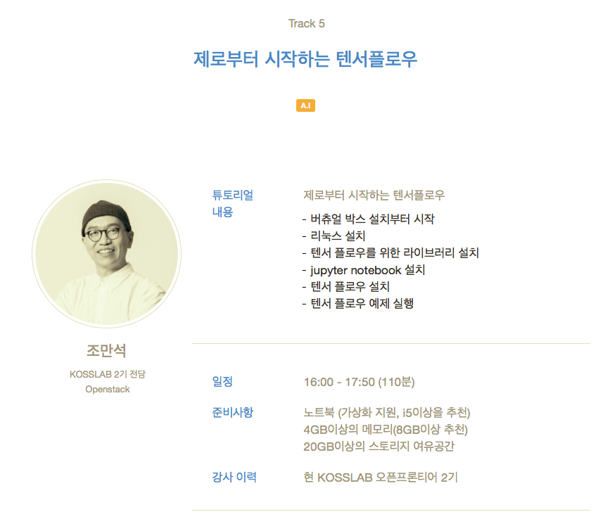

# KOSSCON2016
KOSS Lab. CON 2016 

* 튜토리얼 섹션

[Re: 제로부터 시작하는 텐서플로우](https://kosscon.kr/program/tutorial#11)

## Tutorial index

#### 1 - Introduction
- Hello World ([notebook](https://github.com/hephaex/KOSSCON2016/blob/master/src/01_hello_world.ipynb))

#### 2 - Basic operation
- Matrix multiplication ([notebook](https://github.com/hephaex/KOSSCON2016/blob/master/src/02_matmul.ipynb))

#### 3 - word2vector
- Linear Regression ([notebook](https://github.com/hephaex/KOSSCON2016/blob/master/src/03_word2vector.ipynb))

#### 4 - data representation
- data representation ([notebook](https://github.com/hephaex/KOSSCON2016/blob/master/src/04_data_representation.ipynb))

#### 5 - Linear regression
- Linear regression ([notebook](https://github.com/hephaex/KOSSCON2016/blob/master/src/05_linear_regression.ipynb))

#### 6 - MNIST
- MNIST ([notebook](https://github.com/hephaex/KOSSCON2016/blob/master/src/06_MNIST.ipynb))
